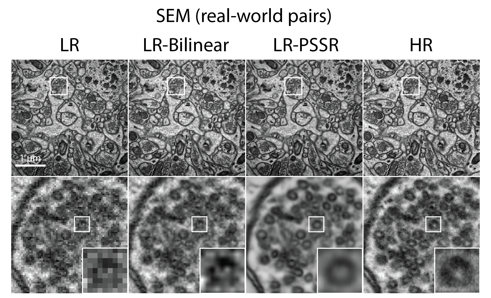

# Point-Scanning Super-Resolution (PSSR)

This repository hosts the PyTorch implementation source code for Point-Scanning Super-Resolution (PSSR), a Deep Learning-based framework that faciliates otherwise unattainable resolution, speed and sensitivity of point-scanning imaging systems (e.g. scanning electron or laser scanning confocal microscopes). 

BioRxiv Preprint: [Deep Learning-Based Point-Scanning Super-Resolution Imaging](https://www.biorxiv.org/content/10.1101/740548v3)

There is also a [PSSR Tweetorial](https://twitter.com/manorlaboratory/status/1169624396891185152?s=20) that explains the whole development story of PSSR.

**Update**: This work has been published in Nature Methods:

Fang, L., Monroe, F., Novak, S.W. et al. Deep learning-based point-scanning super-resolution imaging. Nat Methods (2021). https://doi.org/10.1038/s41592-021-01080-z

[comment]: <>

[comment]: <> 

- [Overview](#overview)
- [Data Availability](#data-availability)
- [Instruction of Use](#instruction-of-use)
- [Citation](#citation)
- [License](#license)

# Overview
Point-scanning imaging systems (e.g. scanning electron or laser scanning confocal microscopes) are perhaps the most widely used tools for high-resolution cellular and tissue imaging, benefitting from an ability to use arbitrary pixel sizes. Like all other imaging modalities, the resolution, speed, sample preservation, and signal-to-noise ratio (SNR) of point-scanning systems are difficult to optimize simultaneously. In particular, point-scanning systems are uniquely constrained by an inverse relationship between imaging speed and pixel resolution. 

Here we show these limitations can be mitigated via the use of Deep Learning-based super-sampling of undersampled images acquired on a point-scanning system, which we termed point-scanning super-resolution (PSSR) imaging. Our proposed PSSR model coule restore undersampled images by increasing optical and pixel resolution, and denoising simultaneously. The model training requires no manually acquired image pairs thanks to the "crappification" method we developed. In addition, the multi-frame PSSR apporach enabled otherwise impossible high spatiotemporal resolution fluorescence timelapse imaging.

# Data Availability

All data are hosted in 3DEM Dataverse: https://doi.org/10.18738/T8/YLCK5A, which include:
- Main models: pretrained models, training and testing data for major PSSR models, including
    - EM (neural tissue imaged on a tSEM)
    - Mitotracker (live imaging of cultured U2OS cells on a ZEISS Airyscan 880 confocal) 
    - Neuronal mitochondria (live imaigng of hippocampal neurons from neonatal rats transfected with mito-dsRed imaged on a ZEISS Airyscan 880 confocal)
 
- Supporting experiments: data for the supporting experiments, including
    - comparison between PSSR and BM3D denosing for both EM and fluorescence Mitotracker data
    - crappifier comparison for both EM and fluorescence Mitotracker data
    - compariosn between PSSR, CARE and Rolling Average for fluorescence Mitotracker data

# Instruction of Use

## Run PSSR from Google Colaboratory (Colab)
Google Colaboratory (Colab) version of PSSR is now ready. ([PSSR - Colab for programmers](https://github.com/BPHO-Salk/PSSR/tree/master/colab_notebooks/))

Another PSSR Colab version that orients to non-programmers is also going to be released soon. ([PSSR - Colab for non-programmers (In progress)](https://github.com/BPHO-Salk/PSSR/tree/master/colab_notebooks/))

Very few libraries need to be installed manually for PSSR Colab verion - most dependencies are preinstalled in the Colab environment. This makes the environment set-up step painless and you will be able to quickly get straight to the real fun. However, it also means some of the libraries you will be using are more recent than the ones used for the manuscript, which can be accessed from the instruction below.

## Run PSSR from the command line 

### System Requirements

#### OS Requirements
This software is only supported for Linux, and has been tested on Ubuntu 18.04.

#### Python Dependencies
PSSR is mainly written with Fastai, and final models used in the manuscript were generated using fast.ai v1.0.55 library.

### Environment Set-up
- Install Anaconda ([Learn more](https://docs.anaconda.com/anaconda/install/))

- Download the repo from Github: 
  `git clone https://github.com/BPHO-Salk/PSSR.git`

- Create a conda environment for pssr:
  `conda create --name pssr python=3.7`

- Activate the conda environment:
  `conda activate pssr`

- Install PSSR dependencies:
  
  `pip install fastai==1.0.55 tifffile libtiff czifile scikit-image`
  
  `pip uninstall torch torchvision` (you may need to run this multiple times)
  
  `conda install pytorch==1.1.0 torchvision==0.3.0 cudatoolkit=10.0 -c pytorch`
  
### Scenario 1: Inference using our pretrained models
Please refer to the handy [Inference_PSSR_for_EM.ipynb](https://github.com/BPHO-Salk/PSSR/blob/master/Inference_PSSR_for_EM.ipynb). You need to modify the path for the test images accordingly. Note the input pixel size needs to be 8 nm.

### Scenario 2: Train your own data
Step 1: Understand your datasource (see details in [gen_sample_info.py](https://github.com/BPHO-Salk/PSSR/tree/master/gen_sample_info.py))

- Example: `python gen_sample_info.py --only mitotracker --out live_mitotracker.csv datasources/live`

Step 2: Generate your training data (see details in [tile_from_info.py](https://github.com/BPHO-Salk/PSSR/tree/master/tile_from_info.py))

- Singleframe example: `python tile_from_info.py --out datasets --info live_mitotracker.csv --n_train 80 --n_valid 20 --n_frames 1 --lr_type s --tile 512 --only mitotracker --crap_func 'new_crap_AG_SP'`

- Multiframe example: `python tile_from_info.py --out datasets --info live_mitotracker.csv --n_train 80 --n_valid 20 --n_frames 5 --lr_type t --tile 512 --only mitotracker --crap_func 'new_crap_AG_SP'`

Step 3: Train your PSSR model (see details in [train.py](https://github.com/BPHO-Salk/PSSR/tree/master/train.py))
- Singleframe example: `python -m fastai.launch train.py --bs 8 --lr 4e-4 --size 512 --tile_sz 512 --datasetname s_1_live_mitotracker_new_crap_AG_SP --cycles 50 --save_name mito_AG_SP --lr_type s --n_frames 1`

- Multiframe example: `python -m fastai.launch train.py --bs 8 --lr 4e-4 --size 512 --tile_sz 512 --datasetname t_5_live_mitotracker_new_crap_AG_SP --cycles 50 --save_name mito_AG_SP --lr_type t --n_frames 5`

Step 4: Run inference on test data (see details in [image_gen.py](https://github.com/BPHO-Salk/PSSR/tree/master/image_gen.py))

- Singleframe example: `python image_gen.py stats/LR stats/LR-PSSR --models s_1_mito_AG_SP_e50_512 --use_tiles --gpu 0`

- Multiframe example: `python image_gen.py stats/LR stats/LR-PSSR --models t_5_mito_AG_SP_e50_512 --use_tiles --gpu 0`

# Citation
Please cite our work if you find it useful for your research: 

Fang, L., Monroe, F., Novak, S.W. et al. Deep learning-based point-scanning super-resolution imaging. Nat Methods (2021). https://doi.org/10.1038/s41592-021-01080-z

# License
Licensed under BSD 3-Clause License.
